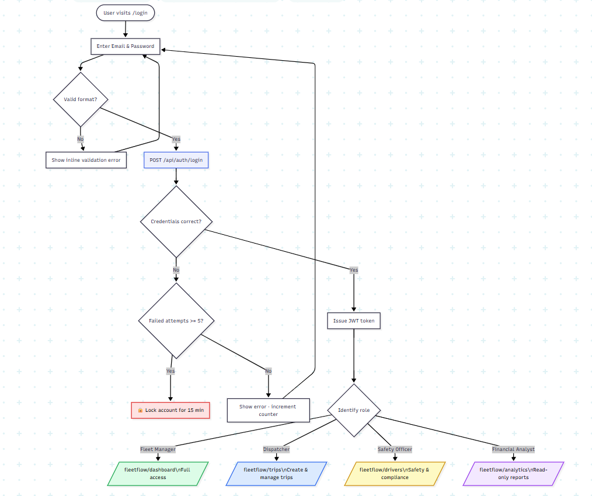
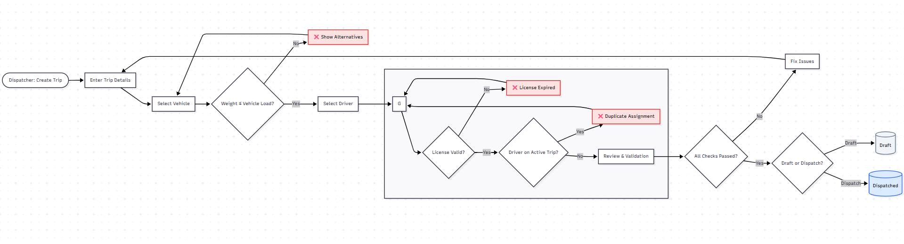
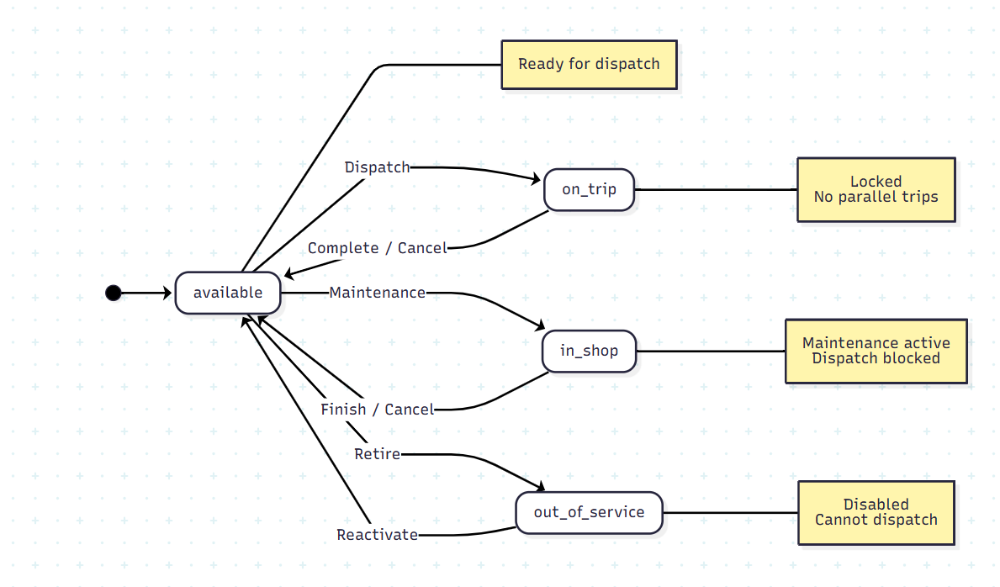
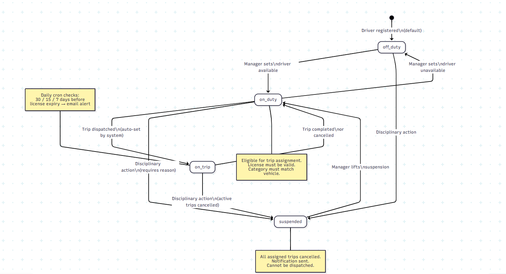
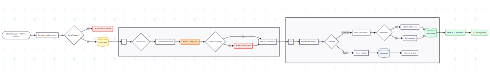

# 🚛 FleetFlow

> **Modular Fleet & Logistics Management System** — Replace manual logbooks with a centralized, rule-based digital platform.


<!--  -->

FleetFlow is a full-stack MERN application for managing fleets, dispatching trips, tracking drivers, logging maintenance, and generating operational analytics — all with strict role-based access control and real-time status synchronization across vehicles and drivers.

---

## 📋 Table of Contents

- [Features](#-features)
- [Tech Stack](#-tech-stack)
- [Project Structure](#-project-structure)
- [Getting Started](#-getting-started)
  - [Prerequisites](#prerequisites)
  - [Backend Setup](#backend-setup)
  - [Frontend Setup](#frontend-setup)
- [Environment Variables](#-environment-variables)
- [API Reference](#-api-reference)
- [Data Models](#-data-models)
- [Role-Based Access Control](#-role-based-access-control)
- [Business Logic & Validation](#-business-logic--validation)
- [Flowcharts](#-flowcharts)
  - [1. User Auth & RBAC Flow](#1-user-auth--rbac-flow)
  - [2. Trip Dispatch Flow](#2-trip-dispatch-flow)
  - [3. Vehicle Status Lifecycle](#3-vehicle-status-lifecycle)
  - [4. Driver Status Lifecycle](#4-driver-status-lifecycle)
  - [5. Maintenance Flow](#5-maintenance-flow)
- [Pages & Routes](#-pages--routes)
- [Contributing](#-contributing)

---

## ✨ Features

- **Command Center Dashboard** — Real-time KPIs: active fleet, maintenance alerts, utilization rate, pending cargo, with auto-refresh every 30 seconds
- **Vehicle Registry** — Full CRUD for fleet assets with status lifecycle management (`available → on_trip → in_shop → out_of_service`)
- **Trip Dispatcher** — Multi-step trip creation with smart validation (cargo weight vs. vehicle capacity, driver license check, duplicate assignment prevention)
- **Maintenance Logs** — Schedule and track preventive/reactive maintenance; automatically blocks vehicle dispatch when `in_shop`
- **Expense & Fuel Tracking** — Per-trip expense logging with automatic fuel efficiency calculations (km/L)
- **Driver Profiles** — Safety scores, license expiry countdowns, training records, incident tracking, and compliance status
- **Operational Analytics** — Fleet utilization, fuel efficiency trends, vehicle ROI, maintenance cost breakdowns, driver performance charts
- **RBAC** — Four roles (Fleet Manager, Dispatcher, Safety Officer, Financial Analyst) with fine-grained resource permissions
- **Notifications** — Email/in-app alerts for license expiry, overdue trips, and maintenance completion
- **CSV / PDF Exports** — Exportable reports for all major entities

---

## 🛠 Tech Stack

| Layer | Technology |
|---|---|
| **Frontend** | React 18, Vite 5, React Router v6, TanStack Query, React Hook Form, Axios |
| **Backend** | Node.js, Express 4 |
| **Database** | MongoDB, Mongoose 8 |
| **Auth** | JSON Web Tokens (JWT), bcryptjs |
| **Validation** | express-validator |
| **File Uploads** | Multer (+ GridFS for files > 1MB) |
| **Dev Tools** | Nodemon, Morgan |

---

## 📁 Project Structure

```
FleetFlow/
├── backend/                        # Express + Node.js API server
│   ├── config/
│   │   └── db.js                   # MongoDB connection
│   ├── models/
│   │   ├── VehicleType.js
│   │   ├── Region.js
│   │   ├── FleetVehicle.js
│   │   ├── FleetDriver.js
│   │   ├── FleetTrip.js
│   │   ├── MaintenanceLog.js
│   │   └── SafetyIncident.js
│   ├── controllers/
│   │   ├── vehicleController.js
│   │   ├── driverController.js
│   │   ├── tripController.js
│   │   └── maintenanceController.js
│   ├── routes/
│   │   ├── vehicleTypeRoutes.js
│   │   ├── regionRoutes.js
│   │   ├── vehicleRoutes.js
│   │   ├── driverRoutes.js
│   │   ├── tripRoutes.js
│   │   └── maintenanceRoutes.js
│   ├── middleware/
│   │   ├── auth.js                 # JWT verification
│   │   ├── errorHandler.js         # Centralized error handling
│   │   └── validate.js             # Request validation
│   ├── .env
│   └── server.js
│
└── frontend/                       # React + Vite client
    └── src/
        ├── api/
        │   └── axios.js            # Axios instance with JWT interceptors
        ├── components/
        │   ├── common/             # Navbar, Sidebar, StatusBadge, StatCard
        │   ├── vehicles/           # VehicleList, VehicleForm
        │   ├── drivers/            # DriverList, DriverForm
        │   ├── trips/              # TripList, TripForm, TripExpenseList
        │   └── maintenance/        # MaintenanceList, MaintenanceForm
        ├── pages/
        │   ├── Dashboard.jsx
        │   ├── Vehicles.jsx
        │   ├── Drivers.jsx
        │   ├── Trips.jsx
        │   └── Maintenance.jsx
        ├── context/
        │   └── AuthContext.jsx
        ├── App.jsx
        └── main.jsx
```

---

## 🚀 Getting Started

### Prerequisites

- Node.js >= 18
- MongoDB (local or Atlas)
- npm or yarn

### Backend Setup

```bash
# Navigate to backend
cd backend

# Install dependencies
npm install

# Create environment file
cp .env.example .env

# Start development server
npm run dev
```

Server runs on **http://localhost:5000**

### Frontend Setup

```bash
# Navigate to frontend
cd frontend

# Install dependencies
npm install

# Start Vite dev server
npm run dev
```

Client runs on **http://localhost:5173**

---

## 🔑 Environment Variables

Create a `.env` file inside the `backend/` directory:

```env
PORT=5000
MONGO_URI=mongodb://localhost:27017/fleetflow
JWT_SECRET=your_jwt_secret_here
```

| Variable | Description |
|---|---|
| `PORT` | Port for the Express server (default: 5000) |
| `MONGO_URI` | MongoDB connection string |
| `JWT_SECRET` | Secret key for signing JWT tokens |

For the frontend, create a `.env` inside `frontend/`:

```env
VITE_API_URL=http://localhost:5000/api
```

---

## 📡 API Reference

All responses follow a consistent envelope:

```json
{ "success": true, "data": { ... } }
{ "success": false, "message": "Error description" }
```

### Vehicles — `/api/vehicles`

| Method | Endpoint | Description |
|---|---|---|
| GET | `/api/vehicles` | List all vehicles (supports `?status=available`) |
| GET | `/api/vehicles/:id` | Get single vehicle |
| POST | `/api/vehicles` | Create vehicle |
| PUT | `/api/vehicles/:id` | Update vehicle |
| DELETE | `/api/vehicles/:id` | Soft-delete vehicle |
| POST | `/api/vehicles/:id/retire` | Set status to `out_of_service` |

### Drivers — `/api/drivers`

| Method | Endpoint | Description |
|---|---|---|
| GET | `/api/drivers` | List all drivers (supports `?status=on_duty`) |
| GET | `/api/drivers/:id` | Get single driver with training records |
| POST | `/api/drivers` | Create driver |
| PUT | `/api/drivers/:id` | Update driver |
| DELETE | `/api/drivers/:id` | Soft-delete driver |
| POST | `/api/drivers/:id/suspend` | Suspend driver (requires reason) |

### Trips — `/api/trips`

| Method | Endpoint | Description |
|---|---|---|
| GET | `/api/trips` | List all trips |
| POST | `/api/trips` | Create trip (status: `draft`) |
| POST | `/api/trips/:id/dispatch` | Dispatch trip → notifies driver, locks vehicle |
| POST | `/api/trips/:id/complete` | Complete trip → releases vehicle & driver |
| POST | `/api/trips/:id/cancel` | Cancel trip (requires `cancellation_reason`) |
| POST | `/api/trips/:id/expenses` | Add expense to trip |

### Maintenance — `/api/maintenance`

| Method | Endpoint | Description |
|---|---|---|
| GET | `/api/maintenance` | List maintenance logs |
| POST | `/api/maintenance` | Create maintenance log |
| PATCH | `/api/maintenance/:id/status` | Update status (`in_progress` / `completed` / `cancelled`) |

### Supporting Resources

| Endpoint | Description |
|---|---|
| `/api/vehicle-types` | CRUD for vehicle categories (Truck, Van, Bike) |
| `/api/regions` | CRUD for operational regions |
| `/api/incidents` | Safety incident log |
| `/api/dashboard` | Aggregated KPI stats |

### Dashboard Response Example

```json
{
  "success": true,
  "data": {
    "vehicles":    { "total": 24, "available": 14, "on_trip": 7, "in_shop": 2, "out_of_service": 1 },
    "drivers":     { "total": 30, "on_duty": 10, "on_trip": 7, "off_duty": 12, "suspended": 1 },
    "trips":       { "total": 480, "active": 7, "completed_this_month": 62, "cancelled_this_month": 3 },
    "maintenance": { "scheduled": 5, "in_progress": 2 }
  }
}
```

### HTTP Error Codes

| Code | Meaning |
|---|---|
| 400 | Validation failure (capacity, license, odometer, missing fields) |
| 404 | Document not found |
| 409 | Unique constraint violated (duplicate license plate, employee ID) |
| 500 | Internal server error |

---

## 🗄 Data Models

### FleetVehicle

```js
{
  license_plate:    String,    
  name:             String,
  vehicle_type_id:  ObjectId,  
  max_load_kg:      Number,
  current_odometer: Number,
  acquisition_date: Date,
  acquisition_cost: Number,
  status:           String,    
  region_id:        ObjectId,  
  notes:            String,
  active:           Boolean
}
```

### FleetDriver

```js
{
  name:                  String,
  employee_id:           String,   
  license_number:        String,   
  license_category:      String,   
  license_expiry:        Date,
  status:                String,   
  safety_score:          Number,   
  trip_completion_rate:  Number,
  training_records:      Array,    
  contact:               { phone, email },
  active:                Boolean
}
```

### FleetTrip

```js
{
  trip_reference: String,   
  origin:         String,
  destination:    String,
  cargo:          { description, weight_kg },
  schedule:       { scheduled_departure, estimated_arrival, actual_departure, actual_arrival },
  priority:       String,   
  vehicle:        { _id, license_plate, name },  
  driver:         { _id, name, employee_id },    
  status:         String,   
  odometer:       { start, end },
  expenses:       Array,    
  cancellation_reason: String,
  active:         Boolean
}
```

### MaintenanceLog

```js
{
  vehicle:             { _id, license_plate, name },
  service_type:        String,  
  dates:               { scheduled, start, completion },
  cost:                Number,
  status:              String,  
  next_service_due_km: Number,
  parts:               Array,   
  active:              Boolean
}
```

### SafetyIncident

```js
{
  driver:        { _id, name, employee_id },
  trip:          { _id, trip_reference },   
  incident_date: Date,
  incident_type: String,  
  severity:      String,  
  description:   String,
  actions_taken: String
}
```

---

## 🔐 Role-Based Access Control

| Resource | Fleet Manager | Dispatcher | Safety Officer | Financial Analyst |
|---|---|---|---|---|
| **Vehicles** | Full CRUD | Read + Update odometer | Read | Read |
| **Drivers** | Full CRUD | Read | Full CRUD | Read |
| **Trips** | Full CRUD | Create, Edit (draft/dispatched), Complete, Cancel | Read | Read |
| **Expenses** | Full CRUD | Create, Edit (own trips) | Read | Read + Export |
| **Maintenance** | Full CRUD | Read | Read | Read |
| **Analytics** | Full access | Own trips only | Safety reports only | Full access + Export |
| **Settings** | Full access | — | — | — |

Post-login redirect by role:

| Role | Redirect |
|---|---|
| Fleet Manager | `/fleetflow/dashboard` |
| Dispatcher | `/fleetflow/trips` |
| Safety Officer | `/fleetflow/drivers` |
| Financial Analyst | `/fleetflow/analytics` |

---

## ⚙️ Business Logic & Validation

### Trip Dispatch — Critical Blocks

| Rule | Behavior |
|---|---|
| `cargo.weight_kg > vehicle.max_load_kg` | Block — show alternative vehicle suggestions |
| `driver.license_expiry <= today` | Hard block — "Driver license expired" |
| `driver.status != "on_duty"` | Block — driver unavailable |
| `vehicle.status != "available"` | Block — vehicle not free |
| Driver already on another active trip | Prevent duplicate assignment |
| `origin == destination` | Reject — invalid route |

### Automatic Status Cascades

```
Dispatch Trip    →  vehicle.status = "on_trip",    driver.status = "on_trip"
Complete Trip    →  vehicle.status = "available",   driver.status = "on_duty", vehicle.odometer updated
Cancel Trip      →  vehicle + driver released back to previous status
Maintenance IN   →  vehicle.status = "in_shop",    active dispatched trips cancelled + notification
Maintenance OUT  →  vehicle.status = "available",   "Vehicle ready for dispatch" notification sent
Suspend Driver   →  all assigned trips cancelled,   notification sent
```

### Safety Score Formula (0–100)

```
Base: 100

Deductions:
  - Traffic violation     → -10 per incident
  - Accident              → -20 per incident
  - Late delivery         →  -2 per occurrence
  - Customer complaint    →  -5 per complaint

Bonuses:
  + 100 trips without incident          → +5
  + Fuel efficiency >15% above average  → +3

Display: > 80 = green · 60–80 = yellow · < 60 = red
```

### Fuel Efficiency Calculation

```
efficiency (km/L) = (current_odometer - last_fuel_odometer) / fuel_quantity
```

Configurable display: `km/L` or `L/100km`

---

## 🗺 Flowcharts
---

### 1. User Auth & RBAC Flow

> How a user logs in, gets validated, and is routed to the correct part of the app based on their role.



---

### 2. Trip Dispatch Flow

> End-to-end lifecycle of a trip from creation through completion or cancellation, including all validation gates.



---

### 3. Vehicle Status Lifecycle

> All possible states a vehicle can be in and what triggers each transition.



---

### 4. Driver Status Lifecycle

> All possible driver states, what triggers each transition, and compliance guards.



---

### 5. Maintenance Flow

> How a maintenance job is created, progresses, and how it automatically affects the linked vehicle's availability.



---

## 📄 Pages & Routes

| Page | Route | Access |
|---|---|---|
| Login | `/web/login` | Public |
| Command Center | `/fleetflow/dashboard` | All roles |
| Vehicle Registry | `/fleetflow/vehicles` | All roles (edit: Manager only) |
| Trip Dispatcher | `/fleetflow/trips` | Manager, Dispatcher |
| Maintenance Logs | `/fleetflow/maintenance` | Manager, Safety Officer (read) |
| Expenses | `/fleetflow/expenses` | Manager, Dispatcher, Financial Analyst |
| Driver Profiles | `/fleetflow/drivers` | Manager, Safety Officer |
| Analytics | `/fleetflow/analytics` | All roles (scope varies) |
| Settings | `/fleetflow/settings` | Fleet Manager only |

---

<p align="center">Built with ❤️ during a hackathon &nbsp;·&nbsp; <a href="https://github.com/jenilsoni01/FleetFlow">github.com/jenilsoni01/FleetFlow</a></p>