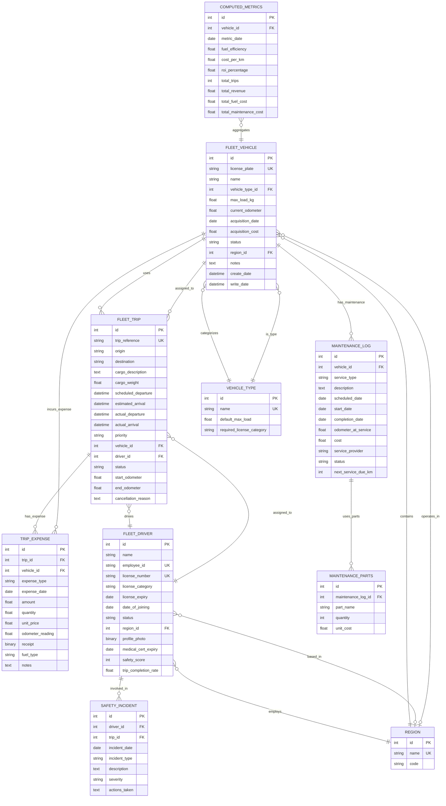

# FleetFlow: Complete Odoo Implementation Specification

**Project**: FleetFlow - Modular Fleet & Logistics Management System  
**Platform**: Odoo 17+  
**Timeline**: 8-hour hackathon MVP + Future phases  
**Objective**: Replace manual logbooks with centralized, rule-based digital fleet management

---

## 1. PAGE-BY-PAGE UI SPECIFICATIONS

### Page 1: Login & Authentication

**Purpose**: Secure role-based access control  
**Route**: `/web/login`

**Components**:
- Email/Username input field (text, required, validation: email format)
- Password input field (password type, required, min 8 chars)
- "Remember Me" checkbox (boolean)
- "Forgot Password" link (redirects to `/web/reset_password`)
- "Login" button (primary action, disabled until valid input)
- Role selector dropdown (if multi-role users exist): Manager, Dispatcher, Safety Officer, Financial Analyst

**Validations**:
- Email format check (RFC 5322 compliant)
- Password strength indicator (visual feedback)
- Max 5 failed attempts before 15-minute lockout
- Session timeout: 8 hours idle, 24 hours absolute

**Quick Actions**: None (login page)

**RBAC Integration**:
- Post-login redirect based on role:
  - Fleet Manager → Command Center (full access)
  - Dispatcher → Trip Dispatcher page (limited vehicle/driver edit)
  - Safety Officer → Driver Performance page
  - Financial Analyst → Operational Analytics (read-only)

---

### Page 2: Command Center (Main Dashboard)

**Purpose**: High-level fleet oversight with real-time KPIs  
**Route**: `/fleetflow/dashboard`

**Components**:

**KPI Cards** (4 primary metrics, auto-refresh every 30s):
1. **Active Fleet** 
   - Count of vehicles with status="on_trip"
   - Icon: truck-moving, color: blue
   - Click → filter vehicles by "On Trip" status
   
2. **Maintenance Alerts**
   - Count of vehicles with status="in_shop"
   - Icon: wrench, color: orange
   - Click → navigate to Maintenance Logs page
   
3. **Utilization Rate**
   - Formula: (Vehicles on trip + Vehicles dispatched) / Total active vehicles * 100
   - Display: percentage with progress bar
   - Color coding: <50% red, 50-75% yellow, >75% green
   
4. **Pending Cargo**
   - Count of trips with status="draft"
   - Icon: box, color: purple
   - Click → Trip Dispatcher with "draft" filter applied

**Charts** (responsive grid layout):
- **Fleet Status Breakdown** (Donut chart): Available, On Trip, In Shop, Out of Service
- **Weekly Trip Volume** (Line chart): Last 7 days completed trips
- **Fuel Spend Trend** (Bar chart): Monthly fuel costs, last 6 months
- **Top 5 Vehicles by Distance** (Horizontal bar): Current month odometer delta

**Filters** (persistent sidebar):
- Vehicle Type: Multi-select dropdown (Truck, Van, Bike, All)
- Status: Multi-select (Available, On Trip, In Shop, Out of Service)
- Region: Multi-select dropdown (populated from regions table)
- Date Range: Calendar picker (defaults to "Last 7 Days")

**Quick Actions** (top-right toolbar):
- "+ New Trip" button (opens Trip Dispatcher modal)
- "🔔 View All Alerts" (opens notification panel)
- "📊 Export Dashboard" (PDF snapshot with current filters)
- "⚙️ Customize Dashboard" (drag-to-reorder widgets)

**Validations**: None (read-only dashboard)

**Data Refresh**: WebSocket or polling every 30s for KPI updates

---

### Page 3: Vehicle Registry (Asset Management)

**Purpose**: CRUD operations for fleet assets  
**Route**: `/fleetflow/vehicles`

**Components**:

**Table View** (Odoo tree view with inline editing):
- Columns: License Plate, Name/Model, Type, Max Load (kg), Current Odometer (km), Status, Actions
- Sortable by any column
- Search bar: Full-text search across name, model, license plate
- Bulk actions: Export selected, Mass update status

**Fields per Vehicle**:
1. **License Plate** (char, unique, required, uppercase auto-format, regex: `^[A-Z0-9-]{6,10}$`)
2. **Name/Model** (char, required, e.g., "Ford Transit Van")
3. **Vehicle Type** (many2one → vehicle_type, required, dropdown: Truck/Van/Bike)
4. **Max Load Capacity** (float, required, unit: kg or tons with toggle)
5. **Current Odometer** (float, required, unit: km, read-only in list, editable in form)
6. **Acquisition Date** (date, required)
7. **Acquisition Cost** (monetary, required, for ROI calculations)
8. **Status** (selection, required):
   - `available` (Green pill)
   - `on_trip` (Blue pill, auto-set by trip assignment)
   - `in_shop` (Orange pill, auto-set by maintenance log)
   - `out_of_service` (Red pill, manual toggle only)
9. **Region** (many2one → region, optional)
10. **Notes** (text, optional, for internal remarks)

**Form View** (modal or full page):
- Tab 1: **Basic Info** (fields 1-8 above)
- Tab 2: **Maintenance History** (one2many → maintenance_log, read-only list)
- Tab 3: **Trip History** (one2many → fleet_trip, read-only list with trip summary)
- Tab 4: **Expense Summary** (smart button to trip_expense aggregated by vehicle)

**Quick Actions**:
- "+ Add Vehicle" button (opens form in create mode)
- "📥 Import Vehicles" (CSV upload with template download)
- "🔧 Schedule Maintenance" (opens maintenance log form with vehicle pre-filled)
- "🚫 Retire Vehicle" (sets status to `out_of_service`, confirmation dialog)

**Validations**:
- License plate uniqueness check (server-side)
- Max Load > 0 constraint
- Acquisition cost > 0 constraint
- Cannot delete vehicle if linked to active trips (foreign key constraint)
- Cannot set status to `available` if active trip exists (Python constraint)

**Business Logic**:
- Setting status to `out_of_service` triggers warning if vehicle has pending trips
- Auto-calculate "Days in Service" (current date - acquisition date)
- Auto-flag vehicles with odometer > 100,000 km for maintenance review

---

### Page 4: Trip Dispatcher & Management

**Purpose**: Create and manage cargo trips with validation  
**Route**: `/fleetflow/trips`

**Components**:

**Trip Creation Form** (modal workflow):

**Step 1: Trip Details**
- Trip Reference (auto-generated, format: `TRIP-YYYYMMDD-####`)
- Origin Address (char, required, autocomplete from Google Maps API)
- Destination Address (char, required, autocomplete)
- Cargo Description (text, required, max 500 chars)
- Cargo Weight (float, required, unit: kg)
- Scheduled Departure (datetime, required, min: now + 30 minutes)
- Estimated Arrival (datetime, auto-calculated from distance or manual override)
- Priority Level (selection: Low/Medium/High/Urgent, default: Medium)

**Step 2: Resource Assignment**
- Select Vehicle (many2one dropdown, filtered by):
  - status = `available`
  - max_load_kg >= cargo_weight (real-time validation)
  - vehicle_type matches cargo requirements (if configured)
- Select Driver (many2one dropdown, filtered by):
  - status = `on_duty`
  - license_expiry > today (hard block if expired)
  - vehicle_category_license matches selected vehicle type
- Show vehicle/driver availability cards with real-time status

**Step 3: Review & Dispatch**
- Summary panel: All entered data
- Validation checklist (visual checkmarks):
  - ✓ Cargo weight <= Vehicle capacity
  - ✓ Driver license valid
  - ✓ Driver not on another active trip
  - ✓ Vehicle not in maintenance
- "Save as Draft" button (status: `draft`)
- "Dispatch Now" button (status: `dispatched`, sends notification to driver)

**Trip Lifecycle States**:
1. `draft` → Can edit all fields
2. `dispatched` → Driver notified, vehicle/driver status → `on_trip`, limited edits
3. `in_transit` → Driver checked in, real-time tracking (if GPS enabled)
4. `completed` → Driver submitted final odometer, vehicle/driver → `available`
5. `cancelled` → Any state can cancel, requires reason (char field), resources released

**Table View** (main trip list):
- Columns: Trip Ref, Origin → Destination, Driver, Vehicle, Cargo (kg), Status, Scheduled, Actions
- Color coding by status: Draft (gray), Dispatched (blue), In Transit (green), Completed (dark green), Cancelled (red)
- Filters: By status, date range, driver, vehicle, region
- Group by: Driver, Vehicle, Status, Week

**Quick Actions**:
- "+ Create Trip" (opens creation modal)
- "🗺️ Route Optimizer" (future: optimize multi-stop trips)
- "📋 Today's Dispatch Schedule" (print view)
- "⚠️ Overdue Trips" (filter trips where estimated_arrival < now and status != completed)

**Validations** (enforced at dispatch):
- **Critical Block**: cargo_weight > vehicle.max_load_kg → Show error modal with alternative vehicle suggestions
- **Critical Block**: driver.license_expiry <= today → "Driver license expired, cannot assign"
- **Warning**: driver has >8 hours active trip time today → Suggest rest period
- **Warning**: vehicle odometer > next_maintenance_km → Recommend scheduling maintenance post-trip
- Prevent duplicate assignments: One driver/vehicle per active trip
- Origin != Destination (basic sanity check)

**State Transitions** (button controls):
- Draft → Dispatched: "Dispatch" button (validates all constraints)
- Dispatched → In Transit: "Check In" button (driver mobile app or manual)
- In Transit → Completed: "Complete Trip" button (requires final_odometer > start_odometer)
- Any → Cancelled: "Cancel" button (requires cancellation_reason)

**Auto-Logic**:
- On "Dispatch": Set vehicle.status = `on_trip`, driver.status = `on_trip`
- On "Complete": Set vehicle.status = `available`, driver.status = `on_duty`, update vehicle.odometer
- On "Cancel": Release vehicle and driver to previous status

---

### Page 5: Maintenance & Service Logs

**Purpose**: Track preventative and reactive vehicle maintenance  
**Route**: `/fleetflow/maintenance`

**Components**:

**Maintenance Log Form**:
1. **Vehicle** (many2one → fleet_vehicle, required, searchable)
2. **Service Type** (selection, required):
   - `oil_change` (Oil Change)
   - `tire_replacement` (Tire Replacement)
   - `brake_service` (Brake Service)
   - `engine_repair` (Engine Repair)
   - `body_work` (Body Work)
   - `inspection` (Safety Inspection)
   - `other` (Other - requires description)
3. **Description** (text, required if type=`other`, max 1000 chars)
4. **Scheduled Date** (date, required)
5. **Start Date** (date, auto-filled when status → `in_progress`)
6. **Completion Date** (date, auto-filled when status → `completed`)
7. **Odometer at Service** (float, auto-filled from vehicle.odometer)
8. **Cost** (monetary, required when status → `completed`)
9. **Service Provider** (char, optional, e.g., "AutoCare Garage")
10. **Parts Replaced** (one2many → maintenance_parts, optional):
    - Part Name (char)
    - Quantity (integer)
    - Unit Cost (monetary)
11. **Status** (selection, default: `scheduled`):
    - `scheduled` (future maintenance)
    - `in_progress` (vehicle currently in shop)
    - `completed` (service finished)
    - `cancelled` (service not performed)
12. **Next Service Due** (integer, km, e.g., "+5000 km from completion")

**Table View**:
- Columns: Vehicle, Service Type, Scheduled Date, Status, Cost, Actions
- Default filter: Show `scheduled` and `in_progress` only
- Group by: Vehicle, Service Type, Month

**Quick Actions**:
- "+ Schedule Maintenance" (opens form)
- "🔔 Upcoming Services" (shows next 7 days scheduled)
- "📊 Maintenance Cost Report" (group by vehicle, export CSV)
- "🚨 Overdue Maintenance" (scheduled_date < today and status = `scheduled`)

**Validations**:
- Cannot schedule maintenance if vehicle.status = `out_of_service`
- Completion date must be >= start date
- Cost must be > 0 when status = `completed`

**Auto-Logic** (critical for dispatcher integration):
- **On Create/Edit** with status = `in_progress`:
  - Set vehicle.status = `in_shop`
  - Cancel any trips with status = `dispatched` for this vehicle (with notification)
  - Remove vehicle from dispatcher's available pool
- **On Complete** (status → `completed`):
  - Set vehicle.status = `available`
  - Update vehicle.odometer if provided
  - Trigger notification: "Vehicle {name} ready for dispatch"
- **On Cancel**:
  - Restore vehicle.status to previous value (if not manually changed)

**Computed Fields**:
- **Days in Shop**: completion_date - start_date (or today - start_date if in_progress)
- **Average Service Cost**: sum(cost) / count(completed services) per vehicle

---

### Page 6: Completed Trip / Expense & Fuel Logging

**Purpose**: Financial tracking per trip and vehicle  
**Route**: `/fleetflow/expenses`

**Components**:

**Trip Expense Form** (embedded in trip completion or standalone):
1. **Related Trip** (many2one → fleet_trip, required, domain: status in [`completed`, `in_transit`])
2. **Vehicle** (many2one → fleet_vehicle, auto-filled from trip, read-only)
3. **Expense Type** (selection, required):
   - `fuel` (Fuel/Gas)
   - `toll` (Toll Fees)
   - `parking` (Parking Fees)
   - `fine` (Traffic Fines)
   - `other` (Other Expense)
4. **Date** (date, required, default: today)
5. **Amount** (monetary, required, >0)
6. **Quantity** (float, conditional required if type=`fuel`, unit: liters or gallons)
7. **Unit Price** (monetary, auto-calculated: amount / quantity if fuel)
8. **Odometer Reading** (float, required for fuel expenses, for efficiency calc)
9. **Receipt** (binary, optional, upload image/PDF)
10. **Notes** (text, optional)

**Fuel-Specific Fields** (shown only when type=`fuel`):
- Fuel Type: Diesel, Petrol, Electric (kWh), CNG
- Station Name (char, optional)
- Auto-calculate **Fuel Efficiency** on save:
  - Formula: `(current_odometer - last_fuel_odometer) / fuel_quantity`
  - Display as: "12.5 km/L" or "8.2 L/100km" (user preference)

**Table View**:
- Columns: Trip Ref, Vehicle, Type, Date, Amount, Quantity, Efficiency, Actions
- Filters: By vehicle, type, date range
- Group by: Vehicle, Expense Type, Month
- **Smart Totals** row: Sum of amounts per filtered group

**Quick Actions**:
- "+ Log Expense" (opens form)
- "⛽ Bulk Fuel Entry" (multi-row quick entry for fuel only)
- "📊 Expense Summary by Vehicle" (pivot table view)
- "📥 Export to Accounting" (CSV with GL code mapping if configured)

**Validations**:
- Amount > 0 required
- Quantity > 0 if type = `fuel`
- Odometer reading must be >= vehicle's last known odometer
- Cannot log expense for trip in `draft` or `cancelled` status
- Receipt file size max 5MB, formats: PDF, JPG, PNG

**Auto-Calculations** (stored in computed fields):
- **Total Operational Cost per Vehicle**: Sum(fuel) + Sum(maintenance.cost) for date range
- **Cost per Kilometer**: total_operational_cost / total_km_driven
- **Monthly Burn Rate**: Sum(expenses) grouped by month

**Integration**:
- On trip completion, prompt driver to log final fuel expense
- Auto-create expense record from driver mobile app (future)
- Push expense data to accounting system via API (if enabled)

---

### Page 7: Driver Performance & Safety Profiles

**Purpose**: Human resource compliance and performance tracking  
**Route**: `/fleetflow/drivers`

**Components**:

**Driver Master Form** (extends res.partner or separate model):
1. **Name** (char, required)
2. **Employee ID** (char, unique, required)
3. **Contact** (phone, email - inherited from res.partner if used)
4. **License Number** (char, unique, required)
5. **License Category** (selection, required):
   - `A` (Motorcycle/Bike)
   - `B` (Light Vehicle/Van)
   - `C` (Heavy Truck)
   - `D` (Bus - if applicable)
6. **License Expiry Date** (date, required, visual warning if < 30 days)
7. **Date of Joining** (date, required)
8. **Status** (selection, default: `off_duty`):
   - `on_duty` (Available for assignment)
   - `on_trip` (Currently assigned to trip)
   - `off_duty` (Not available)
   - `suspended` (Disciplinary action)
9. **Region** (many2one → region, optional)
10. **Profile Photo** (binary, optional)

**Compliance Tab**:
- License Expiry Countdown (computed: days until expiry, red if <30)
- Medical Certificate Expiry (date, optional, required for heavy vehicles)
- Training Completion (one2many → training_records):
  - Training Type (Safety, Defensive Driving, Hazmat)
  - Completion Date
  - Expiry Date (if applicable)
- **Compliance Status** (computed boolean):
  - ✓ All valid if license not expired and no suspensions
  - ✗ Blocked if license expired or status = `suspended`

**Performance Tab**:
- **Total Trips** (computed: count of completed trips)
- **Trip Completion Rate** (%): completed_trips / assigned_trips * 100
- **Average Trip Duration** (hours, computed from trip logs)
- **On-Time Delivery Rate** (%): trips completed before estimated_arrival / total
- **Safety Score** (integer, 0-100, formula below)

**Safety Score Calculation** (weighted average):
- Base score: 100
- Deductions:
  - Traffic violations: -10 per incident
  - Accidents: -20 per incident (logged in safety_incident table)
  - Late deliveries: -2 per occurrence
  - Customer complaints: -5 per complaint
- Bonuses:
  - 100+ trips without incident: +5
  - Fuel efficiency >15% above fleet average: +3
- Display with color: >80 green, 60-80 yellow, <60 red

**Safety Incidents Tab** (one2many → safety_incident):
- Incident Date, Type (Accident, Violation, Near Miss), Description, Severity, Actions Taken

**Table View**:
- Columns: Name, Employee ID, License Expiry, Status, Safety Score, Total Trips, Actions
- Filters: By status, region, license category, compliance (valid/expired)
- **Alert Icons**: 🔴 for expired licenses, ⚠️ for expiring within 30 days

**Quick Actions**:
- "+ Add Driver" (opens form)
- "🚫 Suspend Driver" (bulk action, requires reason)
- "📋 License Renewal Reminders" (email to drivers expiring in 30 days)
- "🏆 Top Performers" (filter by safety score >90, sort by trip count)

**Validations**:
- **Hard Block**: Cannot assign driver to trip if:
  - license_expiry <= today
  - status = `suspended` or `off_duty`
  - license_category doesn't match vehicle_type (e.g., Category A for trucks)
- Unique employee_id and license_number (database constraint)
- License expiry must be future date when creating driver

**Auto-Logic**:
- **Daily Cron Job**: Check all drivers, send email/SMS 30/15/7 days before license expiry
- On trip assignment: Set status = `on_trip`
- On trip completion: Set status = `on_duty`
- On suspension: Cancel all assigned trips, send notification

---

### Page 8: Operational Analytics & Financial Reports

**Purpose**: Data-driven decision making with exportable insights  
**Route**: `/fleetflow/analytics`

**Components**:

**Report Sections** (tabbed layout or separate cards):

**1. Fleet Utilization**
- **KPIs**:
  - Total Fleet Count (active vehicles)
  - Average Daily Utilization % (time on trip / total available time)
  - Vehicle Downtime Hours (sum of time in `in_shop` status)
- **Chart**: Stacked bar chart - daily breakdown of Available/On Trip/In Shop
- **Table**: Vehicle-wise utilization ranking (highest to lowest)

**2. Fuel Efficiency**
- **KPIs**:
  - Fleet Average Efficiency (km/L or L/100km)
  - Total Fuel Spend (current month vs last month, % change)
  - Best/Worst Performing Vehicles (by efficiency)
- **Chart**: Line chart - monthly fuel efficiency trend per vehicle type
- **Table**: Vehicle-wise fuel data with columns: Vehicle, Total Liters, Total Cost, Avg Efficiency, Trips

**3. Vehicle ROI**
- **Formula**: `(Revenue - (Maintenance + Fuel)) / Acquisition Cost * 100`
- **Assumptions**: Revenue per trip (if tracked) or estimated revenue per km
- **KPIs**:
  - Top 5 ROI Vehicles (% return)
  - Bottom 5 ROI Vehicles (candidates for retirement)
  - Fleet Average ROI
- **Chart**: Horizontal bar chart - ROI by vehicle
- **Table**: Vehicle, Acquisition Cost, Total Maintenance, Total Fuel, Revenue, ROI %

**4. Maintenance Analytics**
- **KPIs**:
  - Total Maintenance Spend (current year)
  - Average Cost per Service
  - Vehicles Over Budget (maintenance > projected annual)
- **Chart**: Pie chart - maintenance cost breakdown by service type
- **Table**: Vehicle, Service Count, Total Cost, Avg Days in Shop, Next Due

**5. Driver Performance**
- **KPIs**:
  - Total Active Drivers
  - Average Safety Score
  - Drivers Due for License Renewal (<30 days)
- **Chart**: Scatter plot - trips completed (x-axis) vs safety score (y-axis)
- **Table**: Driver, Trips, Completion Rate, Safety Score, On-Time %

**6. Financial Summary**
- **KPIs**:
  - Total Operational Cost (fuel + maintenance + tolls)
  - Cost per Kilometer (fleet average)
  - Revenue (if tracked)
  - Profit Margin % (if revenue tracked)
- **Chart**: Waterfall chart - revenue to profit breakdown
- **Table**: Monthly P&L statement (if revenue tracked)

**Filters** (apply to all sections):
- Date Range: Presets (Last 7/30/90 days, This Month, Last Month, Custom)
- Vehicle Type: All, Truck, Van, Bike
- Region: All or specific region
- Driver: All or specific driver

**Export Options** (top-right toolbar):
- "📥 Export CSV" (current view data)
- "📄 Export PDF" (formatted report with charts)
- "📧 Schedule Email" (modal to set daily/weekly/monthly email with PDF attachment)
- "📊 Export to Excel" (pivot-ready data dump)

**Quick Actions**:
- "🔄 Refresh Data" (re-run all computations)
- "📌 Save as Report Template" (save current filters/config)
- "📂 Historical Reports" (access previously generated PDFs)
- "⚙️ Configure Metrics" (admin only, customize KPI formulas)

**Validations**: None (read-only analytics)

**Performance Optimization**:
- Pre-compute metrics via scheduled cron (hourly or daily)
- Use materialized views or cache tables for complex aggregations
- Lazy load charts (load on tab switch)
- Paginate large tables (50 rows per page)

---

### Page 9: Admin & Settings

**Purpose**: System configuration and user management  
**Route**: `/fleetflow/settings` (admin only)

**Components**:

**1. User Management**
- Create/Edit users with role assignment
- Password reset for users
- Session management (view active sessions, force logout)
- Audit log: User actions (view only)

**2. Vehicle Type Configuration**
- Add/Edit vehicle types (Truck, Van, Bike, custom)
- Set default max load per type
- Map license categories to vehicle types

**3. Region Management**
- Add/Edit regions (for filtering and reporting)
- Assign default region to vehicles/drivers

**4. Notification Settings**
- Email/SMS templates for:
  - Trip dispatch notifications
  - License expiry reminders
  - Maintenance completion alerts
  - Overdue trip warnings
- Toggle notifications on/off per event type

**5. Expense Categories**
- Add custom expense types beyond defaults
- Set GL code mappings for accounting integration

**6. System Preferences**
- Default currency
- Distance unit (km or miles)
- Volume unit (liters or gallons)
- Date/time format
- Session timeout duration

**7. Integration Settings** (future):
- Google Maps API key
- SMS gateway credentials
- Accounting system API (QuickBooks, Xero)
- GPS tracking provider integration

**8. Data Management**
- Backup database (manual trigger)
- Import/Export wizards for bulk data
- Archive old trips (move to archive table, performance)

**Quick Actions**: None (settings page)

**Validations**:
- Only users with `fleetflow.admin` group can access
- Confirm dialogs for destructive actions (delete types, regions)

---

## 2. RELATIONAL DATA MODEL

### ER Diagram (Mermaid)

## Paste code into mermaid


---
# MongoDB Schema — Fleet Management

## Overview

This schema is restructured from a relational (PostgreSQL) design into a document-oriented MongoDB design. Key principles applied:

- **Embed** documents that are always accessed together (e.g. expenses inside trips, parts inside maintenance logs)
- **Reference** entities that are queried independently or shared across many documents
- **Snapshot pattern** — denormalize key fields (name, license plate) into related documents to reduce lookups
- **Binary fields** — use GridFS for files > 1MB; store `ObjectId` reference instead of raw `Binary`

---

## Collections

### 1. `vehicle_types`

```js
{
  _id: ObjectId(),
  name: String,                        // unique
  default_max_load: Number,            // > 0
  required_license_category: String,   // e.g. "B", "C"
  active: Boolean,
  created_at: Date,
  updated_at: Date
}
```

**Indexes:**
- `{ active: 1 }`

---

### 2. `regions`

```js
{
  _id: ObjectId(),
  name: String,   // unique
  code: String,   // unique, e.g. "US-CA"
  active: Boolean,
  created_at: Date,
  updated_at: Date
}
```

---

### 3. `fleet_vehicles`

Embeds a snapshot of `vehicle_type` and `region` for fast reads.

```js
{
  _id: ObjectId(),
  license_plate: String,              // unique, regex: /^[A-Z0-9-]{6,10}$/
  name: String,
  vehicle_type: {
    _id: ObjectId(),                  // ref → vehicle_types
    name: String,
    required_license_category: String
  },
  max_load_kg: Number,                // > 0
  current_odometer: Number,           // >= 0
  acquisition_date: Date,
  acquisition_cost: Number,           // > 0
  status: String,                     // enum: ["available", "on_trip", "in_shop", "out_of_service"]
  region: {
    _id: ObjectId(),                  // ref → regions
    name: String,
    code: String
  },
  notes: String,
  active: Boolean,
  created_by: ObjectId(),             // ref → users
  updated_by: ObjectId(),
  created_at: Date,
  updated_at: Date
}
```

**Indexes:**
- `{ status: 1 }`
- `{ "vehicle_type._id": 1 }`
- `{ "region._id": 1 }`
- `{ active: 1 }` (sparse: true)

---

### 4. `fleet_drivers`

Embeds `training_records` — always accessed with the driver. `safety_incidents` are kept in a separate collection for cross-driver querying.

```js
{
  _id: ObjectId(),
  name: String,
  employee_id: String,                // unique
  license_number: String,             // unique
  license_category: String,           // enum: ["A", "B", "C", "D"]
  license_expiry: Date,
  date_of_joining: Date,
  status: String,                     // enum: ["on_duty", "on_trip", "off_duty", "suspended"]
  region: {
    _id: ObjectId(),                  // ref → regions
    name: String,
    code: String
  },
  profile_photo: Binary,              // use GridFS ObjectId ref for files > 1MB
  medical_cert_expiry: Date,
  contact: {
    phone: String,
    email: String
  },
  metrics: {
    safety_score: Number,             // 0–100, default: 100
    trip_completion_rate: Number      // 0.00–100.00
  },
  training_records: [
    {
      _id: ObjectId(),
      training_type: String,          // enum: ["safety", "defensive_driving", "hazmat", "other"]
      completion_date: Date,
      expiry_date: Date,
      certificate_number: String,
      active: Boolean,
      created_at: Date
    }
  ],
  active: Boolean,
  created_by: ObjectId(),
  updated_by: ObjectId(),
  created_at: Date,
  updated_at: Date
}
```

**Indexes:**
- `{ status: 1 }`
- `{ license_expiry: 1 }`
- `{ "training_records.expiry_date": 1 }`
- `{ "region._id": 1 }`
- `{ active: 1 }` (sparse: true)

> **Note:** To query drivers with expiring training certs across the fleet, use:
> `db.fleet_drivers.find({ "training_records.expiry_date": { $lte: targetDate } })`

---

### 5. `fleet_trips`

Embeds `expenses` (formerly `trip_expense`) — always accessed with their trip. Vehicle and driver are stored as snapshots plus reference IDs.

```js
{
  _id: ObjectId(),
  trip_reference: String,             // unique
  origin: String,
  destination: String,
  cargo: {
    description: String,
    weight_kg: Number                 // > 0
  },
  schedule: {
    scheduled_departure: Date,
    estimated_arrival: Date,          // must be > scheduled_departure
    actual_departure: Date,
    actual_arrival: Date              // must be > actual_departure if set
  },
  priority: String,                   // enum: ["low", "medium", "high", "urgent"], default: "medium"
  vehicle: {
    _id: ObjectId(),                  // ref → fleet_vehicles
    license_plate: String,
    name: String
  },
  driver: {
    _id: ObjectId(),                  // ref → fleet_drivers
    name: String,
    employee_id: String
  },
  status: String,                     // enum: ["draft", "dispatched", "in_transit", "completed", "cancelled"]
  odometer: {
    start: Number,
    end: Number                       // must be > start if set
  },
  cancellation_reason: String,        // required if status = "cancelled"
  expenses: [
    {
      _id: ObjectId(),
      expense_type: String,           // enum: ["fuel", "toll", "parking", "fine", "other"]
      expense_date: Date,
      amount: Number,                 // > 0
      fuel_details: {                 // only present if expense_type = "fuel"
        quantity: Number,             // liters/gallons, > 0
        unit_price: Number,
        fuel_type: String,            // enum: ["diesel", "petrol", "electric", "cng"]
        station_name: String,
        odometer_reading: Number
      },
      receipt: Binary,               // use GridFS ObjectId ref for large files
      notes: String,
      active: Boolean,
      created_by: ObjectId(),
      created_at: Date
    }
  ],
  active: Boolean,
  created_by: ObjectId(),
  updated_by: ObjectId(),
  created_at: Date,
  updated_at: Date
}
```

**Indexes:**
- `{ status: 1 }`
- `{ "vehicle._id": 1 }`
- `{ "driver._id": 1 }`
- `{ "schedule.scheduled_departure": 1 }`
- `{ trip_reference: 1 }` (unique)
- `{ active: 1 }` (sparse: true)

---

### 6. `maintenance_logs`

Embeds `parts` (formerly `maintenance_parts`) — always fetched with the log.

```js
{
  _id: ObjectId(),
  vehicle: {
    _id: ObjectId(),                  // ref → fleet_vehicles
    license_plate: String,
    name: String
  },
  service_type: String,               // enum: ["oil_change", "tire_replacement", "brake_service",
                                      //        "engine_repair", "body_work", "inspection", "other"]
  description: String,                // required if service_type = "other"
  dates: {
    scheduled: Date,
    start: Date,
    completion: Date                  // must be >= start if set
  },
  odometer_at_service: Number,
  cost: Number,                       // required if status = "completed", > 0
  service_provider: String,
  status: String,                     // enum: ["scheduled", "in_progress", "completed", "cancelled"]
  next_service_due_km: Number,
  parts: [
    {
      _id: ObjectId(),
      part_name: String,
      quantity: Number,               // > 0
      unit_cost: Number,              // > 0
      total_cost: Number,             // derived: quantity * unit_cost
      created_at: Date
    }
  ],
  active: Boolean,
  created_by: ObjectId(),
  updated_by: ObjectId(),
  created_at: Date,
  updated_at: Date
}
```

**Indexes:**
- `{ "vehicle._id": 1 }`
- `{ status: 1 }`
- `{ "dates.scheduled": 1 }`

---

### 7. `safety_incidents`

Kept as a standalone collection — incidents are queried independently across drivers and trips.

```js
{
  _id: ObjectId(),
  driver: {
    _id: ObjectId(),                  // ref → fleet_drivers
    name: String,
    employee_id: String
  },
  trip: {                             // optional
    _id: ObjectId(),                  // ref → fleet_trips
    trip_reference: String
  },
  incident_date: Date,
  incident_type: String,              // enum: ["accident", "violation", "near_miss", "complaint"]
  description: String,
  severity: String,                   // enum: ["minor", "moderate", "severe"]
  actions_taken: String,
  active: Boolean,
  created_by: ObjectId(),
  updated_by: ObjectId(),
  created_at: Date,
  updated_at: Date
}
```

**Indexes:**
- `{ "driver._id": 1 }`
- `{ incident_date: 1 }`
- `{ incident_type: 1 }`

---

### 8. `computed_metrics`

One document per vehicle per day — time-series style. Consider using MongoDB native **Time Series Collections** (MongoDB 5.0+) for better compression and performance.

```js
{
  _id: ObjectId(),
  vehicle: {
    _id: ObjectId(),                  // ref → fleet_vehicles
    license_plate: String
  },
  metric_date: Date,                  // unique per vehicle
  fuel_efficiency: Number,            // km/L or L/100km
  cost_per_km: Number,
  roi_percentage: Number,
  totals: {
    trips: Number,
    revenue: Number,
    fuel_cost: Number,
    maintenance_cost: Number
  },
  updated_at: Date
}
```

**Indexes:**
- `{ "vehicle._id": 1, metric_date: 1 }` (unique)
- `{ metric_date: 1 }`

---

## Design Decisions Summary

| Decision | Rationale |
|---|---|
| Embed `trip_expense` inside `fleet_trips` | Expenses are always accessed with their trip; no independent queries |
| Embed `maintenance_parts` inside `maintenance_logs` | Parts are always fetched with the log; no cross-log part queries |
| Embed `training_records` inside `fleet_drivers` | Training is driver-centric; queried with driver profile |
| Separate collection for `safety_incidents` | Incidents are queried across drivers and trips independently |
| Snapshot pattern on vehicle/driver in trips | Avoids expensive joins on read-heavy queries; keep `_id` for authoritative lookup |
| `Binary` for photos/receipts | Fine for small files; use **GridFS** + `ObjectId` reference for files > 1MB |
| `computed_metrics` as time-series | Consider MongoDB native Time Series Collections (5.0+) for compression & performance |


# FleetFlow — MERN Stack Skeleton

## Project Structure

```
fleetflow/
├── server/                        # Express + Node.js backend
│   ├── config/
│   │   └── db.js
│   ├── models/
│   │   ├── VehicleType.js
│   │   ├── Region.js
│   │   ├── FleetVehicle.js
│   │   ├── FleetDriver.js
│   │   ├── FleetTrip.js
│   │   ├── MaintenanceLog.js
│   │   └── SafetyIncident.js
│   ├── routes/
│   │   ├── vehicleTypeRoutes.js
│   │   ├── regionRoutes.js
│   │   ├── vehicleRoutes.js
│   │   ├── driverRoutes.js
│   │   ├── tripRoutes.js
│   │   └── maintenanceRoutes.js
│   ├── controllers/
│   │   ├── vehicleController.js
│   │   ├── driverController.js
│   │   ├── tripController.js
│   │   └── maintenanceController.js
│   ├── middleware/
│   │   ├── auth.js
│   │   ├── errorHandler.js
│   │   └── validate.js
│   ├── .env
│   ├── server.js
│   └── package.json
│
└── client/                        # React frontend
    ├── src/
    │   ├── api/
    │   │   └── axios.js
    │   ├── components/
    │   │   ├── common/
    │   │   │   ├── Navbar.jsx
│   │   │   ├── Sidebar.jsx
    │   │   │   ├── StatusBadge.jsx
    │   │   │   └── StatCard.jsx
    │   │   ├── vehicles/
    │   │   │   ├── VehicleList.jsx
    │   │   │   └── VehicleForm.jsx
    │   │   ├── drivers/
    │   │   │   ├── DriverList.jsx
    │   │   │   └── DriverForm.jsx
    │   │   ├── trips/
    │   │   │   ├── TripList.jsx
    │   │   │   ├── TripForm.jsx
    │   │   │   └── TripExpenseList.jsx
    │   │   └── maintenance/
    │   │       ├── MaintenanceList.jsx
    │   │       └── MaintenanceForm.jsx
    │   ├── pages/
    │   │   ├── Dashboard.jsx
    │   │   ├── Vehicles.jsx
    │   │   ├── Drivers.jsx
    │   │   ├── Trips.jsx
    │   │   └── Maintenance.jsx
    │   ├── context/
    │   │   └── AuthContext.jsx
    │   ├── App.jsx
    │   └── main.jsx
    └── package.json
```

---

## Backend

### `server/package.json`

```json
{
  "name": "fleetflow-server",
  "version": "1.0.0",
  "scripts": {
    "start": "node server.js",
    "dev": "nodemon server.js"
  },
  "dependencies": {
    "express": "^4.18.2",
    "mongoose": "^8.0.0",
    "dotenv": "^16.3.1",
    "bcryptjs": "^2.4.3",
    "jsonwebtoken": "^9.0.2",
    "express-validator": "^7.0.1",
    "cors": "^2.8.5",
    "morgan": "^1.10.0",
    "multer": "^1.4.5-lts.1"
  },
  "devDependencies": {
    "nodemon": "^3.0.2"
  }
}
```

---

### `server/config/db.js`

```js
const mongoose = require('mongoose');

const connectDB = async () => {
  try {
    const conn = await mongoose.connect(process.env.MONGO_URI);
    console.log(`MongoDB Connected: ${conn.connection.host}`);
  } catch (error) {
    console.error(`DB Error: ${error.message}`);
    process.exit(1);
  }
};

module.exports = connectDB;
```

---

### `server/server.js`

```js
require('dotenv').config();
const express = require('express');
const cors = require('cors');
const morgan = require('morgan');
const connectDB = require('./config/db');
const errorHandler = require('./middleware/errorHandler');

connectDB();

const app = express();

app.use(cors());
app.use(morgan('dev'));
app.use(express.json());

// Routes
app.use('/api/vehicle-types', require('./routes/vehicleTypeRoutes'));
app.use('/api/regions',       require('./routes/regionRoutes'));
app.use('/api/vehicles',      require('./routes/vehicleRoutes'));
app.use('/api/drivers',       require('./routes/driverRoutes'));
app.use('/api/trips',         require('./routes/tripRoutes'));
app.use('/api/maintenance',   require('./routes/maintenanceRoutes'));

app.use(errorHandler);

const PORT = process.env.PORT || 5000;
app.listen(PORT, () => console.log(`Server running on port ${PORT}`));
```

---

### `server/.env`

```
PORT=5000
MONGO_URI=mongodb://localhost:27017/fleetflow
JWT_SECRET=your_jwt_secret_here
```

---

## Mongoose Models

### `server/models/VehicleType.js`

```js
const mongoose = require('mongoose');

const vehicleTypeSchema = new mongoose.Schema({
  name: { type: String, required: true, unique: true, trim: true },
  default_max_load: { type: Number, required: true, min: 0.01 },
  required_license_category: {
    type: String,
    required: true,
    enum: ['A', 'B', 'C', 'D']
  },
  active: { type: Boolean, default: true }
}, { timestamps: true });

module.exports = mongoose.model('VehicleType', vehicleTypeSchema);
```

---

### `server/models/Region.js`

```js
const mongoose = require('mongoose');

const regionSchema = new mongoose.Schema({
  name: { type: String, required: true, unique: true, trim: true },
  code: { type: String, required: true, unique: true, maxlength: 10, trim: true },
  active: { type: Boolean, default: true }
}, { timestamps: true });

module.exports = mongoose.model('Region', regionSchema);
```

---

### `server/models/FleetVehicle.js`

```js
const mongoose = require('mongoose');

const fleetVehicleSchema = new mongoose.Schema({
  license_plate: {
    type: String,
    required: true,
    unique: true,
    uppercase: true,
    match: [/^[A-Z0-9-]{6,10}$/, 'License plate must be 6-10 alphanumeric characters']
  },
  name: { type: String, required: true, trim: true },
  vehicle_type_id: {
    type: mongoose.Schema.Types.ObjectId,
    ref: 'VehicleType',
    required: true
  },
  max_load_kg: { type: Number, required: true, min: 0.01 },
  current_odometer: { type: Number, default: 0, min: 0 },
  acquisition_date: { type: Date, required: true },
  acquisition_cost: { type: Number, required: true, min: 0.01 },
  status: {
    type: String,
    enum: ['available', 'on_trip', 'in_shop', 'out_of_service'],
    default: 'available'
  },
  region_id: { type: mongoose.Schema.Types.ObjectId, ref: 'Region', default: null },
  notes: { type: String },
  active: { type: Boolean, default: true }
}, { timestamps: true });

fleetVehicleSchema.index({ status: 1 });
fleetVehicleSchema.index({ active: 1 });

module.exports = mongoose.model('FleetVehicle', fleetVehicleSchema);
```

---

### `server/models/FleetDriver.js`

```js
const mongoose = require('mongoose');

const trainingRecordSchema = new mongoose.Schema({
  training_type: {
    type: String,
    enum: ['safety', 'defensive_driving', 'hazmat', 'other'],
    required: true
  },
  completion_date: { type: Date, required: true },
  expiry_date: { type: Date },
  certificate_number: { type: String },
  active: { type: Boolean, default: true }
}, { timestamps: true });

const fleetDriverSchema = new mongoose.Schema({
  name: { type: String, required: true, trim: true },
  employee_id: { type: String, required: true, unique: true, trim: true },
  license_number: { type: String, required: true, unique: true, trim: true },
  license_category: { type: String, required: true, enum: ['A', 'B', 'C', 'D'] },
  license_expiry: { type: Date, required: true },
  date_of_joining: { type: Date, required: true },
  status: {
    type: String,
    enum: ['on_duty', 'on_trip', 'off_duty', 'suspended'],
    default: 'off_duty'
  },
  region_id: { type: mongoose.Schema.Types.ObjectId, ref: 'Region', default: null },
  phone: { type: String },
  email: { type: String },
  profile_photo: { type: String },            // GridFS file ID or URL
  medical_cert_expiry: { type: Date },
  safety_score: { type: Number, default: 100, min: 0, max: 100 },
  trip_completion_rate: { type: Number, default: 0 },
  training_records: [trainingRecordSchema],   // Embedded
  active: { type: Boolean, default: true }
}, { timestamps: true });

fleetDriverSchema.index({ status: 1 });
fleetDriverSchema.index({ license_expiry: 1 });
fleetDriverSchema.index({ 'training_records.expiry_date': 1 });

// Virtual: license status
fleetDriverSchema.virtual('license_status').get(function () {
  if (!this.license_expiry) return 'unknown';
  const days = Math.floor((this.license_expiry - Date.now()) / 86400000);
  if (days < 0) return 'expired';
  if (days <= 30) return 'expiring_soon';
  return 'valid';
});

fleetDriverSchema.set('toJSON', { virtuals: true });

module.exports = mongoose.model('FleetDriver', fleetDriverSchema);
```

---

### `server/models/FleetTrip.js`

```js
const mongoose = require('mongoose');

const expenseSchema = new mongoose.Schema({
  expense_type: {
    type: String,
    required: true,
    enum: ['fuel', 'toll', 'parking', 'fine', 'other']
  },
  expense_date: { type: Date, required: true, default: Date.now },
  amount: { type: Number, required: true, min: 0.01 },
  fuel_details: {
    quantity: { type: Number },            // liters
    unit_price: { type: Number },
    fuel_type: { type: String, enum: ['diesel', 'petrol', 'electric', 'cng'] },
    station_name: { type: String },
    odometer_reading: { type: Number }
  },
  receipt: { type: String },               // file URL or GridFS ID
  notes: { type: String },
  active: { type: Boolean, default: true }
}, { timestamps: true });

const fleetTripSchema = new mongoose.Schema({
  trip_reference: { type: String, unique: true },
  origin: { type: String, required: true },
  destination: { type: String, required: true },
  cargo_description: { type: String, required: true },
  cargo_weight: { type: Number, required: true, min: 0.01 },
  scheduled_departure: { type: Date, required: true },
  estimated_arrival: { type: Date, required: true },
  actual_departure: { type: Date },
  actual_arrival: { type: Date },
  priority: {
    type: String,
    enum: ['low', 'medium', 'high', 'urgent'],
    default: 'medium'
  },
  vehicle_id: {
    type: mongoose.Schema.Types.ObjectId,
    ref: 'FleetVehicle',
    required: true
  },
  driver_id: {
    type: mongoose.Schema.Types.ObjectId,
    ref: 'FleetDriver',
    required: true
  },
  status: {
    type: String,
    enum: ['draft', 'dispatched', 'in_transit', 'completed', 'cancelled'],
    default: 'draft'
  },
  start_odometer: { type: Number },
  end_odometer: { type: Number },
  cancellation_reason: { type: String },
  expenses: [expenseSchema],                // Embedded
  active: { type: Boolean, default: true }
}, { timestamps: true });

// Auto-generate trip reference
fleetTripSchema.pre('save', async function (next) {
  if (!this.trip_reference) {
    const count = await mongoose.model('FleetTrip').countDocuments();
    this.trip_reference = `TRIP-${String(count + 1).padStart(5, '0')}`;
  }
  next();
});

// Validate dates
fleetTripSchema.pre('save', function (next) {
  if (this.estimated_arrival <= this.scheduled_departure)
    return next(new Error('Estimated arrival must be after scheduled departure'));
  if (this.origin === this.destination)
    return next(new Error('Origin and destination cannot be the same'));
  next();
});

fleetTripSchema.virtual('distance_traveled').get(function () {
  if (this.start_odometer && this.end_odometer)
    return this.end_odometer - this.start_odometer;
  return 0;
});

fleetTripSchema.set('toJSON', { virtuals: true });

fleetTripSchema.index({ status: 1 });
fleetTripSchema.index({ vehicle_id: 1 });
fleetTripSchema.index({ driver_id: 1 });

module.exports = mongoose.model('FleetTrip', fleetTripSchema);
```

---

### `server/models/MaintenanceLog.js`

```js
const mongoose = require('mongoose');

const partSchema = new mongoose.Schema({
  part_name: { type: String, required: true },
  quantity: { type: Number, required: true, min: 1 },
  unit_cost: { type: Number, required: true, min: 0.01 }
}, { timestamps: true });

partSchema.virtual('total_cost').get(function () {
  return this.quantity * this.unit_cost;
});

const maintenanceLogSchema = new mongoose.Schema({
  vehicle_id: {
    type: mongoose.Schema.Types.ObjectId,
    ref: 'FleetVehicle',
    required: true
  },
  service_type: {
    type: String,
    required: true,
    enum: ['oil_change', 'tire_replacement', 'brake_service', 'engine_repair', 'body_work', 'inspection', 'other']
  },
  description: { type: String },
  scheduled_date: { type: Date, required: true },
  start_date: { type: Date },
  completion_date: { type: Date },
  odometer_at_service: { type: Number },
  cost: { type: Number, min: 0 },
  service_provider: { type: String },
  status: {
    type: String,
    enum: ['scheduled', 'in_progress', 'completed', 'cancelled'],
    default: 'scheduled'
  },
  next_service_due_km: { type: Number },
  parts: [partSchema],                        // Embedded
  active: { type: Boolean, default: true }
}, { timestamps: true });

// Validate: "other" type needs description
maintenanceLogSchema.pre('save', function (next) {
  if (this.service_type === 'other' && !this.description)
    return next(new Error('Description is required for service type "other"'));
  if (this.status === 'completed' && (!this.cost || this.cost <= 0))
    return next(new Error('Cost is required for completed maintenance'));
  if (this.completion_date && this.start_date && this.completion_date < this.start_date)
    return next(new Error('Completion date cannot be before start date'));
  next();
});

maintenanceLogSchema.index({ vehicle_id: 1 });
maintenanceLogSchema.index({ status: 1 });
maintenanceLogSchema.index({ scheduled_date: 1 });

module.exports = mongoose.model('MaintenanceLog', maintenanceLogSchema);
```

---

### `server/models/SafetyIncident.js`

```js
const mongoose = require('mongoose');

const safetyIncidentSchema = new mongoose.Schema({
  driver_id: {
    type: mongoose.Schema.Types.ObjectId,
    ref: 'FleetDriver',
    required: true
  },
  trip_id: {
    type: mongoose.Schema.Types.ObjectId,
    ref: 'FleetTrip',
    default: null
  },
  incident_date: { type: Date, required: true },
  incident_type: {
    type: String,
    required: true,
    enum: ['accident', 'violation', 'near_miss', 'complaint']
  },
  description: { type: String, required: true },
  severity: { type: String, required: true, enum: ['minor', 'moderate', 'severe'] },
  actions_taken: { type: String },
  active: { type: Boolean, default: true }
}, { timestamps: true });

safetyIncidentSchema.index({ driver_id: 1 });
safetyIncidentSchema.index({ incident_date: 1 });

module.exports = mongoose.model('SafetyIncident', safetyIncidentSchema);
```

---

## Controllers

### `server/controllers/vehicleController.js`

```js
const FleetVehicle = require('../models/FleetVehicle');

// GET /api/vehicles
exports.getAll = async (req, res, next) => {
  try {
    const { status, region_id, active = true } = req.query;
    const filter = { active };
    if (status) filter.status = status;
    if (region_id) filter.region_id = region_id;

    const vehicles = await FleetVehicle.find(filter)
      .populate('vehicle_type_id', 'name required_license_category')
      .populate('region_id', 'name code')
      .sort({ name: 1 });

    res.json({ success: true, count: vehicles.length, data: vehicles });
  } catch (err) { next(err); }
};

// GET /api/vehicles/:id
exports.getOne = async (req, res, next) => {
  try {
    const vehicle = await FleetVehicle.findById(req.params.id)
      .populate('vehicle_type_id')
      .populate('region_id');
    if (!vehicle) return res.status(404).json({ success: false, message: 'Vehicle not found' });
    res.json({ success: true, data: vehicle });
  } catch (err) { next(err); }
};

// POST /api/vehicles
exports.create = async (req, res, next) => {
  try {
    const vehicle = await FleetVehicle.create(req.body);
    res.status(201).json({ success: true, data: vehicle });
  } catch (err) { next(err); }
};

// PUT /api/vehicles/:id
exports.update = async (req, res, next) => {
  try {
    const vehicle = await FleetVehicle.findByIdAndUpdate(req.params.id, req.body, {
      new: true, runValidators: true
    });
    if (!vehicle) return res.status(404).json({ success: false, message: 'Vehicle not found' });
    res.json({ success: true, data: vehicle });
  } catch (err) { next(err); }
};

// DELETE /api/vehicles/:id  (soft delete)
exports.remove = async (req, res, next) => {
  try {
    await FleetVehicle.findByIdAndUpdate(req.params.id, { active: false });
    res.json({ success: true, message: 'Vehicle deactivated' });
  } catch (err) { next(err); }
};

// POST /api/vehicles/:id/retire
exports.retire = async (req, res, next) => {
  try {
    const vehicle = await FleetVehicle.findById(req.params.id);
    if (!vehicle) return res.status(404).json({ success: false, message: 'Vehicle not found' });
    if (vehicle.status === 'on_trip')
      return res.status(400).json({ success: false, message: 'Cannot retire vehicle with active trip' });
    vehicle.status = 'out_of_service';
    await vehicle.save();
    res.json({ success: true, data: vehicle });
  } catch (err) { next(err); }
};
```

---

### `server/controllers/tripController.js`

```js
const FleetTrip = require('../models/FleetTrip');
const FleetVehicle = require('../models/FleetVehicle');
const FleetDriver = require('../models/FleetDriver');

// GET /api/trips
exports.getAll = async (req, res, next) => {
  try {
    const { status, vehicle_id, driver_id } = req.query;
    const filter = { active: true };
    if (status) filter.status = status;
    if (vehicle_id) filter.vehicle_id = vehicle_id;
    if (driver_id) filter.driver_id = driver_id;

    const trips = await FleetTrip.find(filter)
      .populate('vehicle_id', 'license_plate name')
      .populate('driver_id', 'name employee_id')
      .sort({ scheduled_departure: -1 });

    res.json({ success: true, count: trips.length, data: trips });
  } catch (err) { next(err); }
};

// POST /api/trips
exports.create = async (req, res, next) => {
  try {
    const { vehicle_id, driver_id, cargo_weight } = req.body;

    const vehicle = await FleetVehicle.findById(vehicle_id);
    const driver = await FleetDriver.findById(driver_id);

    if (!vehicle) return res.status(404).json({ success: false, message: 'Vehicle not found' });
    if (!driver) return res.status(404).json({ success: false, message: 'Driver not found' });

    // Capacity check
    if (cargo_weight > vehicle.max_load_kg)
      return res.status(400).json({ success: false, message: `Cargo (${cargo_weight}kg) exceeds vehicle capacity (${vehicle.max_load_kg}kg)` });

    // License check
    if (new Date(driver.license_expiry) < new Date())
      return res.status(400).json({ success: false, message: 'Driver has an expired license' });

    if (driver.status === 'suspended')
      return res.status(400).json({ success: false, message: 'Driver is suspended' });

    const trip = await FleetTrip.create(req.body);
    res.status(201).json({ success: true, data: trip });
  } catch (err) { next(err); }
};

// POST /api/trips/:id/dispatch
exports.dispatch = async (req, res, next) => {
  try {
    const trip = await FleetTrip.findById(req.params.id)
      .populate('vehicle_id')
      .populate('driver_id');

    if (!trip) return res.status(404).json({ success: false, message: 'Trip not found' });
    if (trip.status !== 'draft')
      return res.status(400).json({ success: false, message: 'Only draft trips can be dispatched' });

    // Duplicate assignment check
    const driverBusy = await FleetTrip.findOne({
      driver_id: trip.driver_id._id,
      status: { $in: ['dispatched', 'in_transit'] },
      _id: { $ne: trip._id }
    });
    if (driverBusy)
      return res.status(400).json({ success: false, message: `Driver already on trip ${driverBusy.trip_reference}` });

    const vehicleBusy = await FleetTrip.findOne({
      vehicle_id: trip.vehicle_id._id,
      status: { $in: ['dispatched', 'in_transit'] },
      _id: { $ne: trip._id }
    });
    if (vehicleBusy)
      return res.status(400).json({ success: false, message: `Vehicle already on trip ${vehicleBusy.trip_reference}` });

    // Update statuses
    await FleetVehicle.findByIdAndUpdate(trip.vehicle_id._id, { status: 'on_trip' });
    await FleetDriver.findByIdAndUpdate(trip.driver_id._id, { status: 'on_trip' });

    trip.status = 'dispatched';
    trip.actual_departure = new Date();
    trip.start_odometer = trip.vehicle_id.current_odometer;
    await trip.save();

    res.json({ success: true, data: trip });
  } catch (err) { next(err); }
};

// POST /api/trips/:id/complete
exports.complete = async (req, res, next) => {
  try {
    const { end_odometer } = req.body;
    const trip = await FleetTrip.findById(req.params.id);

    if (!trip) return res.status(404).json({ success: false, message: 'Trip not found' });
    if (!['dispatched', 'in_transit'].includes(trip.status))
      return res.status(400).json({ success: false, message: 'Trip cannot be completed from current status' });

    if (!end_odometer || end_odometer <= trip.start_odometer)
      return res.status(400).json({ success: false, message: 'Valid end odometer required' });

    await FleetVehicle.findByIdAndUpdate(trip.vehicle_id, {
      status: 'available',
      current_odometer: end_odometer
    });
    await FleetDriver.findByIdAndUpdate(trip.driver_id, { status: 'on_duty' });

    trip.status = 'completed';
    trip.end_odometer = end_odometer;
    trip.actual_arrival = new Date();
    await trip.save();

    res.json({ success: true, data: trip });
  } catch (err) { next(err); }
};

// POST /api/trips/:id/cancel
exports.cancel = async (req, res, next) => {
  try {
    const { cancellation_reason } = req.body;
    if (!cancellation_reason)
      return res.status(400).json({ success: false, message: 'Cancellation reason required' });

    const trip = await FleetTrip.findById(req.params.id);
    if (!trip) return res.status(404).json({ success: false, message: 'Trip not found' });
    if (trip.status === 'completed')
      return res.status(400).json({ success: false, message: 'Cannot cancel a completed trip' });

    if (['dispatched', 'in_transit'].includes(trip.status)) {
      await FleetVehicle.findByIdAndUpdate(trip.vehicle_id, { status: 'available' });
      await FleetDriver.findByIdAndUpdate(trip.driver_id, { status: 'on_duty' });
    }

    trip.status = 'cancelled';
    trip.cancellation_reason = cancellation_reason;
    await trip.save();

    res.json({ success: true, data: trip });
  } catch (err) { next(err); }
};

// POST /api/trips/:id/expenses   (add embedded expense)
exports.addExpense = async (req, res, next) => {
  try {
    const trip = await FleetTrip.findById(req.params.id);
    if (!trip) return res.status(404).json({ success: false, message: 'Trip not found' });

    trip.expenses.push(req.body);
    await trip.save();

    res.status(201).json({ success: true, data: trip.expenses.at(-1) });
  } catch (err) { next(err); }
};
```

---

### `server/controllers/maintenanceController.js`

```js
const MaintenanceLog = require('../models/MaintenanceLog');
const FleetVehicle = require('../models/FleetVehicle');

exports.getAll = async (req, res, next) => {
  try {
    const { vehicle_id, status } = req.query;
    const filter = { active: true };
    if (vehicle_id) filter.vehicle_id = vehicle_id;
    if (status) filter.status = status;

    const logs = await MaintenanceLog.find(filter)
      .populate('vehicle_id', 'license_plate name')
      .sort({ scheduled_date: -1 });

    res.json({ success: true, data: logs });
  } catch (err) { next(err); }
};

exports.create = async (req, res, next) => {
  try {
    const log = await MaintenanceLog.create(req.body);
    res.status(201).json({ success: true, data: log });
  } catch (err) { next(err); }
};

exports.updateStatus = async (req, res, next) => {
  try {
    const { status, cost, completion_date, odometer_at_service } = req.body;
    const log = await MaintenanceLog.findById(req.params.id).populate('vehicle_id');
    if (!log) return res.status(404).json({ success: false, message: 'Log not found' });

    log.status = status;
    if (cost) log.cost = cost;
    if (completion_date) log.completion_date = completion_date;
    if (odometer_at_service) log.odometer_at_service = odometer_at_service;

    // Auto-update vehicle status
    if (status === 'in_progress') {
      await FleetVehicle.findByIdAndUpdate(log.vehicle_id._id, { status: 'in_shop' });
    } else if (status === 'completed' || status === 'cancelled') {
      const otherInProgress = await MaintenanceLog.findOne({
        vehicle_id: log.vehicle_id._id,
        status: 'in_progress',
        _id: { $ne: log._id }
      });
      if (!otherInProgress) {
        await FleetVehicle.findByIdAndUpdate(log.vehicle_id._id, { status: 'available' });
      }
      if (status === 'completed' && odometer_at_service) {
        await FleetVehicle.findByIdAndUpdate(log.vehicle_id._id, { current_odometer: odometer_at_service });
      }
    }

    await log.save();
    res.json({ success: true, data: log });
  } catch (err) { next(err); }
};
```

---

## Routes

### `server/routes/vehicleRoutes.js`

```js
const router = require('express').Router();
const ctrl = require('../controllers/vehicleController');

router.get('/',        ctrl.getAll);
router.get('/:id',     ctrl.getOne);
router.post('/',       ctrl.create);
router.put('/:id',     ctrl.update);
router.delete('/:id',  ctrl.remove);
router.post('/:id/retire', ctrl.retire);

module.exports = router;
```

### `server/routes/tripRoutes.js`

```js
const router = require('express').Router();
const ctrl = require('../controllers/tripController');

router.get('/',                   ctrl.getAll);
router.post('/',                  ctrl.create);
router.post('/:id/dispatch',      ctrl.dispatch);
router.post('/:id/complete',      ctrl.complete);
router.post('/:id/cancel',        ctrl.cancel);
router.post('/:id/expenses',      ctrl.addExpense);

module.exports = router;
```

### `server/routes/maintenanceRoutes.js`

```js
const router = require('express').Router();
const ctrl = require('../controllers/maintenanceController');

router.get('/',              ctrl.getAll);
router.post('/',             ctrl.create);
router.patch('/:id/status',  ctrl.updateStatus);

module.exports = router;
```

---

## Middleware

### `server/middleware/errorHandler.js`

```js
module.exports = (err, req, res, next) => {
  console.error(err);
  const status = err.statusCode || 500;
  const message = err.message || 'Internal Server Error';

  // Mongoose duplicate key
  if (err.code === 11000) {
    const field = Object.keys(err.keyValue)[0];
    return res.status(400).json({ success: false, message: `${field} already exists` });
  }
  // Mongoose validation
  if (err.name === 'ValidationError') {
    const messages = Object.values(err.errors).map(e => e.message);
    return res.status(400).json({ success: false, message: messages.join(', ') });
  }

  res.status(status).json({ success: false, message });
};
```

---

## Frontend (React)

### `client/package.json`

```json
{
  "name": "fleetflow-client",
  "private": true,
  "scripts": {
    "dev": "vite",
    "build": "vite build"
  },
  "dependencies": {
    "react": "^18.2.0",
    "react-dom": "^18.2.0",
    "react-router-dom": "^6.21.0",
    "axios": "^1.6.2",
    "react-hook-form": "^7.49.2",
    "@tanstack/react-query": "^5.14.2"
  },
  "devDependencies": {
    "vite": "^5.0.8",
    "@vitejs/plugin-react": "^4.2.1"
  }
}
```

---

### `client/src/api/axios.js`

```js
import axios from 'axios';

const api = axios.create({
  baseURL: import.meta.env.VITE_API_URL || 'http://localhost:5000/api',
  headers: { 'Content-Type': 'application/json' }
});

api.interceptors.request.use(config => {
  const token = localStorage.getItem('token');
  if (token) config.headers.Authorization = `Bearer ${token}`;
  return config;
});

api.interceptors.response.use(
  res => res,
  err => {
    if (err.response?.status === 401) window.location.href = '/login';
    return Promise.reject(err);
  }
);

export default api;
```

---

### `client/src/App.jsx`

```jsx
import { BrowserRouter, Routes, Route, Navigate } from 'react-router-dom';
import { QueryClient, QueryClientProvider } from '@tanstack/react-query';
import Sidebar from './components/common/Sidebar';
import Dashboard from './pages/Dashboard';
import Vehicles from './pages/Vehicles';
import Drivers from './pages/Drivers';
import Trips from './pages/Trips';
import Maintenance from './pages/Maintenance';

const queryClient = new QueryClient();

export default function App() {
  return (
    <QueryClientProvider client={queryClient}>
      <BrowserRouter>
        <div style={{ display: 'flex' }}>
          <Sidebar />
          <main style={{ flex: 1, padding: '1.5rem' }}>
            <Routes>
              <Route path="/" element={<Navigate to="/dashboard" />} />
              <Route path="/dashboard"   element={<Dashboard />} />
              <Route path="/vehicles"    element={<Vehicles />} />
              <Route path="/drivers"     element={<Drivers />} />
              <Route path="/trips"       element={<Trips />} />
              <Route path="/maintenance" element={<Maintenance />} />
            </Routes>
          </main>
        </div>
      </BrowserRouter>
    </QueryClientProvider>
  );
}
```

---

### `client/src/pages/Trips.jsx`

```jsx
import { useState } from 'react';
import { useQuery, useMutation, useQueryClient } from '@tanstack/react-query';
import api from '../api/axios';
import TripList from '../components/trips/TripList';
import TripForm from '../components/trips/TripForm';

export default function Trips() {
  const [showForm, setShowForm] = useState(false);
  const qc = useQueryClient();

  const { data, isLoading } = useQuery({
    queryKey: ['trips'],
    queryFn: () => api.get('/trips').then(r => r.data.data)
  });

  const createTrip = useMutation({
    mutationFn: body => api.post('/trips', body),
    onSuccess: () => { qc.invalidateQueries(['trips']); setShowForm(false); }
  });

  const dispatch = useMutation({
    mutationFn: id => api.post(`/trips/${id}/dispatch`),
    onSuccess: () => qc.invalidateQueries(['trips'])
  });

  const complete = useMutation({
    mutationFn: ({ id, end_odometer }) => api.post(`/trips/${id}/complete`, { end_odometer }),
    onSuccess: () => qc.invalidateQueries(['trips'])
  });

  const cancel = useMutation({
    mutationFn: ({ id, reason }) => api.post(`/trips/${id}/cancel`, { cancellation_reason: reason }),
    onSuccess: () => qc.invalidateQueries(['trips'])
  });

  if (isLoading) return <p>Loading...</p>;

  return (
    <div>
      <div style={{ display: 'flex', justifyContent: 'space-between', marginBottom: 16 }}>
        <h1>Trips</h1>
        <button onClick={() => setShowForm(true)}>+ New Trip</button>
      </div>
      {showForm && (
        <TripForm
          onSubmit={createTrip.mutate}
          onClose={() => setShowForm(false)}
        />
      )}
      <TripList
        trips={data || []}
        onDispatch={id => dispatch.mutate(id)}
        onComplete={(id, odo) => complete.mutate({ id, end_odometer: odo })}
        onCancel={(id, reason) => cancel.mutate({ id, reason })}
      />
    </div>
  );
}
```

---

### `client/src/components/trips/TripList.jsx`

```jsx
import StatusBadge from '../common/StatusBadge';

export default function TripList({ trips, onDispatch, onComplete, onCancel }) {
  return (
    <table width="100%" cellPadding={8} style={{ borderCollapse: 'collapse' }}>
      <thead>
        <tr style={{ background: '#f0f0f0', textAlign: 'left' }}>
          <th>Reference</th>
          <th>Route</th>
          <th>Driver</th>
          <th>Vehicle</th>
          <th>Status</th>
          <th>Priority</th>
          <th>Actions</th>
        </tr>
      </thead>
      <tbody>
        {trips.map(trip => (
          <tr key={trip._id} style={{ borderBottom: '1px solid #eee' }}>
            <td>{trip.trip_reference}</td>
            <td>{trip.origin} → {trip.destination}</td>
            <td>{trip.driver_id?.name}</td>
            <td>{trip.vehicle_id?.license_plate}</td>
            <td><StatusBadge status={trip.status} /></td>
            <td>{trip.priority}</td>
            <td style={{ display: 'flex', gap: 4 }}>
              {trip.status === 'draft' && (
                <button onClick={() => onDispatch(trip._id)}>Dispatch</button>
              )}
              {['dispatched', 'in_transit'].includes(trip.status) && (
                <button onClick={() => {
                  const odo = prompt('Enter end odometer reading:');
                  if (odo) onComplete(trip._id, Number(odo));
                }}>Complete</button>
              )}
              {!['completed', 'cancelled'].includes(trip.status) && (
                <button onClick={() => {
                  const reason = prompt('Cancellation reason:');
                  if (reason) onCancel(trip._id, reason);
                }}>Cancel</button>
              )}
            </td>
          </tr>
        ))}
      </tbody>
    </table>
  );
}
```

---

### `client/src/components/trips/TripForm.jsx`

```jsx
import { useForm } from 'react-hook-form';
import { useQuery } from '@tanstack/react-query';
import api from '../../api/axios';

export default function TripForm({ onSubmit, onClose }) {
  const { register, handleSubmit, formState: { errors } } = useForm();

  const { data: vehicles } = useQuery({
    queryKey: ['vehicles-available'],
    queryFn: () => api.get('/vehicles?status=available').then(r => r.data.data)
  });

  const { data: drivers } = useQuery({
    queryKey: ['drivers-available'],
    queryFn: () => api.get('/drivers?status=on_duty').then(r => r.data.data)
  });

  return (
    <form onSubmit={handleSubmit(onSubmit)} style={{ background: '#f9f9f9', padding: 16, marginBottom: 16 }}>
      <h3>New Trip</h3>
      <div style={{ display: 'grid', gridTemplateColumns: '1fr 1fr', gap: 12 }}>
        <div>
          <label>Origin</label>
          <input {...register('origin', { required: true })} style={{ width: '100%' }} />
          {errors.origin && <span style={{ color: 'red' }}>Required</span>}
        </div>
        <div>
          <label>Destination</label>
          <input {...register('destination', { required: true })} style={{ width: '100%' }} />
        </div>
        <div>
          <label>Cargo Weight (kg)</label>
          <input type="number" step="0.01" {...register('cargo_weight', { required: true, min: 0.01 })} style={{ width: '100%' }} />
        </div>
        <div>
          <label>Priority</label>
          <select {...register('priority')} style={{ width: '100%' }}>
            <option value="low">Low</option>
            <option value="medium">Medium</option>
            <option value="high">High</option>
            <option value="urgent">Urgent</option>
          </select>
        </div>
        <div>
          <label>Vehicle</label>
          <select {...register('vehicle_id', { required: true })} style={{ width: '100%' }}>
            <option value="">-- Select --</option>
            {vehicles?.map(v => (
              <option key={v._id} value={v._id}>{v.license_plate} — {v.name} (max {v.max_load_kg}kg)</option>
            ))}
          </select>
        </div>
        <div>
          <label>Driver</label>
          <select {...register('driver_id', { required: true })} style={{ width: '100%' }}>
            <option value="">-- Select --</option>
            {drivers?.map(d => (
              <option key={d._id} value={d._id}>{d.name} ({d.employee_id})</option>
            ))}
          </select>
        </div>
        <div>
          <label>Cargo Description</label>
          <textarea {...register('cargo_description', { required: true })} style={{ width: '100%' }} />
        </div>
        <div>
          <label>Scheduled Departure</label>
          <input type="datetime-local" {...register('scheduled_departure', { required: true })} style={{ width: '100%' }} />
        </div>
        <div>
          <label>Estimated Arrival</label>
          <input type="datetime-local" {...register('estimated_arrival', { required: true })} style={{ width: '100%' }} />
        </div>
      </div>
      <div style={{ marginTop: 12, display: 'flex', gap: 8 }}>
        <button type="submit">Create Trip</button>
        <button type="button" onClick={onClose}>Cancel</button>
      </div>
    </form>
  );
}
```

---

### `client/src/components/common/StatusBadge.jsx`

```jsx
const colors = {
  available:      '#16a34a',
  on_trip:        '#2563eb',
  in_shop:        '#d97706',
  out_of_service: '#dc2626',
  draft:          '#6b7280',
  dispatched:     '#2563eb',
  in_transit:     '#7c3aed',
  completed:      '#16a34a',
  cancelled:      '#dc2626',
  on_duty:        '#16a34a',
  off_duty:       '#6b7280',
  suspended:      '#dc2626',
};

export default function StatusBadge({ status }) {
  return (
    <span style={{
      background: colors[status] || '#888',
      color: '#fff',
      padding: '2px 10px',
      borderRadius: 12,
      fontSize: 12,
      fontWeight: 600,
      textTransform: 'capitalize'
    }}>
      {status?.replace(/_/g, ' ')}
    </span>
  );
}
```

---

### `client/src/components/common/Sidebar.jsx`

```jsx
import { NavLink } from 'react-router-dom';

const links = [
  { to: '/dashboard',   label: '📊 Dashboard' },
  { to: '/vehicles',    label: '🚛 Vehicles' },
  { to: '/drivers',     label: '👤 Drivers' },
  { to: '/trips',       label: '🗺️ Trips' },
  { to: '/maintenance', label: '🔧 Maintenance' },
];

export default function Sidebar() {
  return (
    <nav style={{ width: 220, minHeight: '100vh', background: '#1e293b', padding: '1rem 0' }}>
      <div style={{ color: '#fff', fontWeight: 700, fontSize: 20, padding: '0 1rem 1rem' }}>
        FleetFlow
      </div>
      {links.map(link => (
        <NavLink key={link.to} to={link.to} style={({ isActive }) => ({
          display: 'block',
          padding: '10px 1.5rem',
          color: isActive ? '#38bdf8' : '#cbd5e1',
          textDecoration: 'none',
          background: isActive ? '#0f172a' : 'transparent',
          fontWeight: isActive ? 600 : 400,
        })}>
          {link.label}
        </NavLink>
      ))}
    </nav>
  );
}
```

---

## API Reference Summary

| Method | Endpoint | Description |
|---|---|---|
| GET | `/api/vehicles` | List vehicles (filter by status, region) |
| POST | `/api/vehicles` | Create vehicle |
| PUT | `/api/vehicles/:id` | Update vehicle |
| POST | `/api/vehicles/:id/retire` | Retire vehicle |
| GET | `/api/drivers` | List drivers |
| POST | `/api/drivers` | Create driver |
| POST | `/api/drivers/:id/suspend` | Suspend driver |
| GET | `/api/trips` | List trips (filter by status, vehicle, driver) |
| POST | `/api/trips` | Create trip (validates capacity + license) |
| POST | `/api/trips/:id/dispatch` | Dispatch trip |
| POST | `/api/trips/:id/complete` | Complete trip (requires end odometer) |
| POST | `/api/trips/:id/cancel` | Cancel trip (requires reason) |
| POST | `/api/trips/:id/expenses` | Add expense to trip |
| GET | `/api/maintenance` | List maintenance logs |
| POST | `/api/maintenance` | Create maintenance log |
| PATCH | `/api/maintenance/:id/status` | Update maintenance status (auto-updates vehicle) |
| GET | `/api/vehicle-types` | List vehicle types |
| GET | `/api/regions` | List regions |

---

## Key Business Logic Mapping (Odoo → MERN)

| Odoo Pattern | MERN Equivalent |
|---|---|
| `@api.constrains` | Mongoose `pre('save')` hooks + controller validation |
| `_compute_*` fields | Mongoose `virtual` fields |
| `One2many` / `Many2one` | `ref` + `.populate()` or embedded arrays |
| `mail.thread` messages | Append to an `activity_log` array in each document |
| Sequence (`ir.sequence`) | `pre('save')` counter-based reference generator |
| `action_dispatch()` | `POST /trips/:id/dispatch` controller |
| `active` archive | Soft delete via `active: false` filter |
| `_sql_constraints` | Mongoose schema validators + unique indexes |